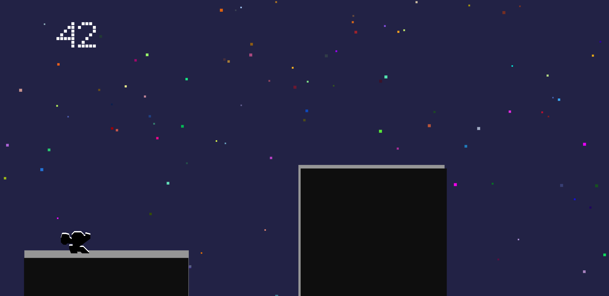

**sml+ (sml_plus)**  
*A minimal platformer*  



Simple 2D platformer where player guide a character jumping between moving platforms. Core features:

- 🌟 **Procedural particles**: Dynamic starfield background
- 📊 **Local score tracking**: Personal best saving
- 📱 **Responsive design**: Works on mobile and desktop
- 🎵 **Original soundtrack** by Ledo de Ananaso

### Technical approach:
- Vanilla JavaScript implementation
- Canvas-based rendering
- Adaptive movement mechanics
- Efficient object recycling

[Experience sml+ Now](https://ommatotritonophryticus.github.io/sml_plus/)

**License**: [GPLv3](https://www.gnu.org/licenses/gpl-3.0.en.html)  
**Soundtrack**: Ledo de Ananaso  

```
Controls:
- Space/Tap: Jump
- Avoid falling off-screen
- Each jump: +1 point
```

*A compact gaming experience focused on rhythm and precision*
